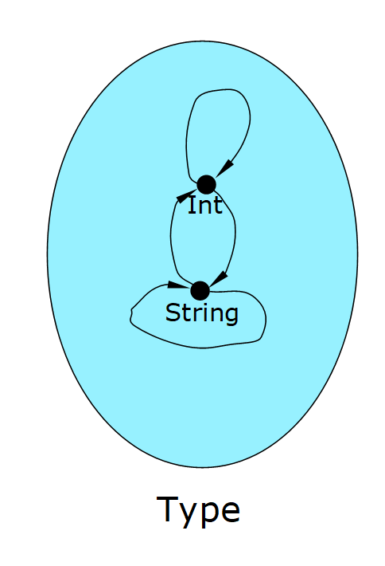
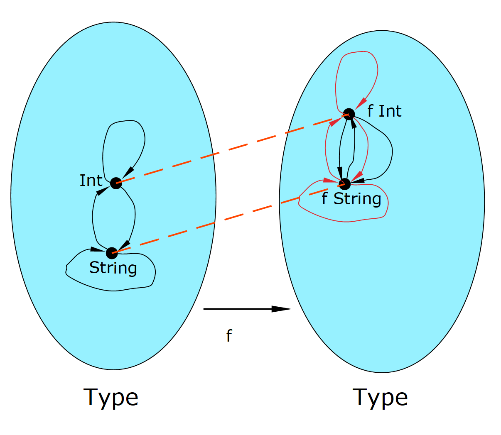
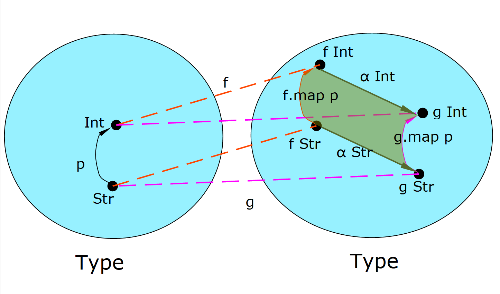
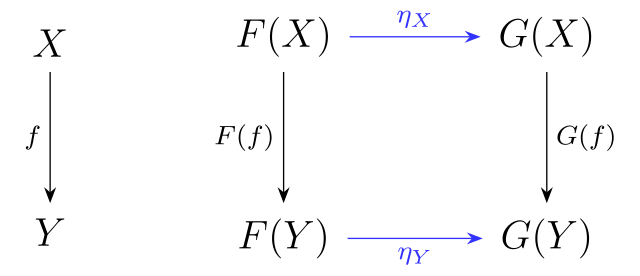
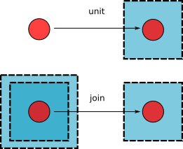

# 导言

以 Haskell 等语言为代表的**函数式编程**(functional programming, 简称 FP )可能是人人都听说过的，但从数据上来看普及率还相对较低。函数式语言不仅是计算机辅助证明的基础，事实上在我看来这本来也是最适合有一定数学基础的人学习的程序语言。然而我其实没看到很 concise 引导文章，要不然过于详尽，要不然作者没有足够的数学基础。而 FP 方面的大佬往往更倾向于讨论更技术性的问题，所以入门级别的文章的确不多见。于是想写一篇作为[计算机辅助证明简介](https://zhuanlan.zhihu.com/p/181671237)的后续(或者前置)，一方面正好可以讲解一些在辅助证明中需要用到的概念和思想，另一方面也是对 FP 的安利吧。也可以也看作是学习笔记吧，有错误的地方也欢迎指正。

事实上我自己也算是FP入门新手，不可能讲太深刻的东西，不过正是这样我恰恰还能体会一些入门时的困难点。本文将不限于某种特定的语言，更关注FP背后的思想，所以有时候为了方便理解可能会写一些格式不太准确的代码。我依旧把我介绍的内容归为数学，正如 Haskell 的创始人之一 Philip Wadler 在[一次演讲](https://www.bilibili.com/video/bv1nk4y1273w)的最后讲到的一样：
>我认为**信息学**(informatics)是一个更好的词(来描述这些知识)，计算机科学(computer science)只有计算机和科学。因为这些知识并不是只与计算机有关，它是关于**信息的模式**(patterns of information)的。另外如果你是真正的科学的话，你不用把科学加到你的名字里。


# 为什么 FP 很重要

相信类似的说法大家已经看过很多了，其中最为经典的便是Haskell的另一创始人 John Hughes ( Haskell 的创始人真的有点多)的同名[论文](https://www.cs.kent.ac.uk/people/staff/dat/miranda/whyfp90.pdf)和[演讲](https://www.bilibili.com/video/BV14W411b7cr)。

在没有介绍详细内容前，我能谈到的一些基于我个人经历的感受。

- 理解之后，上手很快
  - 我真正开始学习FP到现在也就大半年，我在2020年元旦开始学习 elm ，不到一个月后(中途还夹杂着期末考试)我就用它做了一个[黎曼面上游戏demo](https://github.com/iamcxds/Monodromy)(当然这也和 elm 本身易上手有关)。里面用到的很多方法都是命令式编程实现起来很麻烦的

- 轻松写出 bug-free 的代码
  - 我依旧记得用 C# 做游戏遇到莫名其妙的 bug 气得锤桌子。但是利用基于类型系统的静态类型检查，FP 可以在代码还未编译前就发现错误，并且根据有类型信息的报错信息这些错误往往很容易改正。因为是没有副作用(side effect)的纯函数代码，除此之外的 bug 就很少了，elm 甚至声称它不会有 runtime 错误。
  
- 基于类型的代码好写更好读
  - 类型系统除了能提供静态检查功能外，还能提供大量的信息(在计算机辅助证明中甚至能代表数学命题)。通过类型系统，我们可以构建更好的程序模型(如接下来会介绍的elm架构)，更有助于我们拆分模块化程序。而程序函数的类型同时也能起到指示函数的作用的功能，这也极大的帮助了我这样不习惯写注释的人看懂自己的代码。

# 年轻人的第一个 FP 语言
  
对于第一次学习 FP 的人，我一定会推荐 [elm](https://elm-lang.org/) 这个语言，不仅因为它简单(虽然它功能有限，也有着种种问题，但对新手入门已经足够了)，而且是直接编译成网页的 JavaScript 脚本。这两点意味着它可以极快速地构建出可视的小玩意(而不只是命令行里的一句`Hello world`)，甚至不需要用户安装任何东西，直接在浏览器里捣鼓[在线编辑器](https://elm-lang.org/try)就可以了。
当然如果未来真的希望使用 FP 进行 JS 相关的开发，我还是更推荐功能更全面的 [Purescript](https://www.purescript.org/)，不过 Purescript 不太适合初学者上手，所以也可以先学习 elm 作为跳板。

我们便使用 elm 作为我们目前例子的语言，因为各种 FP 里的语法结构大同小异，切换起来也很方便。

在开始正式介绍之前，我们先明确一下**函数**(function)和**类型**(type)的概念。函数最粗浅地理解是就是类型(集合)之间的映射，除此之外不做任何事情。数学上对函数的认识是考虑它具体**是什么**，并认为它是“瞬间”完成的，而不是考虑**一步一步**去达成目标。这也是FP和命令式编程在思想上的核心区别。所以 FP 中是没有计算机中传统的“变量”这个概念的，所有记号对应的都是常量，当然对于函数还是可以谈论其变量的。
用$A \rightarrow B$记类型A到类型B的函数的类型。最简单的例子

```elm
plusOne : Int -> Int
plusOne n = n + 1 --用这种方式定义函数，把自变量直接写在函数后
```

而因为函数本身也构成类型，所以函数类型也可以作为定义域和值域(甚至有些情况下函数类型与非函数类型没有明确的界限)

```elm
five : (Int -> Int) -> Int --函数类型作为定义域
five f = f 5 --即 f(5)，而这种写法可以省去不少括号。
--以函数为自变量固定取其在5的值作为结果的函数。

plus : Int -> (Int -> Int)--函数类型作为值域，我们默认 ->是右结合的，所以这种时候的括号可以省略
plus x =
  let --使用let in可以定义一些局部使用的记号
    xPlus : Int -> Int --这里的类型声明可以省略
    xPlus y = x + y --根据x得到的加上x函数
  in
    xPlus --以xPlus为结果

--不过这样下去类型会写得越来越长，我们可以给类型命名，可以用type alias 给类型定义一个记号
type alias IIi = Int -> Int -> Int
--另外你会嫌定义函数太麻烦，其实我们有更简便的写法
plus1 : IIi
plus1 x = \y -> x+y -- 用\符号可以定义一个匿名函数，\y表明自变量，箭头 -> 后写上函数的结果，后面我们可以看到这是一种λ表达式。

--当我们运行函数时
> (plus 3) 5 -- 先计算plus 3的结果，得到加3的函数，再对5应用
8
> plus1 5 3 --函数的应用默认是右结合的，所以可以不用加括号
8
```

我们很惊讶的发现，当我们用函数作为值域的时候似乎定义出了二元函数。事实上这并不奇怪，在集合范畴我们很容易得到同构$\rm{Hom}(A,\rm{Hom}(B,C))\cong\rm{Hom}(A\times B,C)$( Hom 在这里就表示两个集合间的映射集合)。如果继续这种操作，我们甚至可以定义任意多元函数类型。这种将多元函数定义为值域为函数的函数的操作，被称为 curry 化。这样操作带来的好处是：从内核上来讲FP里面只有一元函数，各种系统和理论处理起来更容易(认识到这件事能对读懂报错信息很有帮助)；但是使用时可以没有通常区别得一样定义，使用任意多元函数。

```elm
plus2 : IIi
plus2 x y = x + y --可以直接像多元函数一样定义

plus3 : IIi
plus3 = \x y -> x + y --也可以直接用匿名表达式定义“多元”函数
```

## Elm架构(The Elm Architecture)

所有第一次听说 FP 的人都会有这样的疑问：如果真的是没有副作用的纯函数程序话，如何实现人机交互？不然除了能做计算程序还可以干什么？

专家也许马上会开始解释什么是 monad ，但是与其让初学者陷入这些概念的泥潭，我们不如先把这个东西当成黑盒(black box)，我们先来看看有了某个黑盒之后纯函数是怎么通过其实现交互程序的。

Elm架构就是一个很好的黑盒，事实上它本身也是诸如网页应用，游戏等交互程序很好的范式。虽然我总觉得这么好的东西可能不是elm原创的，这个架构也有一些 FRP (functional reactive programming)的影子，不过似乎网上都这样叫我们就沿用吧。我们主要参考的是elm的[官方指导](https://guide.elm-lang.org/)，这个官方写得挺好挺concise，之后大家可以自行继续学习。

一个交互程序可以分解为三个部分：

- 模型(Model)——某个数据类型用于存储当前状态,另外我们还应该定义一个初始数据对应于程序刚开始的状态
- 显示(View)——将当前状态数据渲染成前端显示元素的函数，在这里是渲染成Html代码
- 更新(Update)——根据前端传来的消息(message，简写 msg)对状态数据进行更新的函数

")

根据描述，我们大概可以想象这些部分所需要函数和类型。

```elm
--首先是模型部分
type alias Model = ... --定义状态数据类型，事实上可以理解为全体“全局变量”
init : Model
init = ... --定义初始数据

--接下来是更新部分

type alias Msg = .. --定义消息类型

update : Msg -> Model -> Model --有两种角度来看待这个函数：当做是消息和当前状态的二元函数，以此决定下一个函数；当做是消息的一元函数，结果是对状态如何更新的函数
update msg model = ...

--最后是显示类型

view : Model -> Html Msg -- 这里类型写成这样的具体含义不用管，因为网页即是显示部件又是交互部件，这样的含义是把状态渲染成Html网页，而且网页可以回传Msg类型的消息。事实上这里的Html是一个函子。
view model = ...
```

所以，对于一个最简单的例子，做一个可以加减数的按钮，代码就是[这样](https://elm-lang.org/examples/buttons),大家可以点击代开在线编辑器体验。

```elm
-- MAIN
main =
  Browser.sandbox { init = init, update = update, view = view }--Browser.sandbox就是黑盒的本体，只需要按规定定义好类型和函数，输入进去就可以实现想要的程序。另外由于FP不是逐条运行命令的，所以这些定义在前在后都不影响。
--sandbox另一个神奇的地方在于，不像我们之前定义的函数，定义域类型是固定的，而是满足一定相关条件的类型都可以接受。这实际上是一种多态(polymorphism),这种功能需要更复杂的类型系统才能实现，比如后文会提到的type class。
-- MODEL
type alias Model = Int
init : Model
init =
  0
-- UPDATE
type Msg  --Msg所对应的类型的含义我们将在后文讲解
  = Increment
  | Decrement

update : Msg -> Model -> Model
update msg model =
  case msg of  --这里使用了模式匹配(pattern matching),将在后文讲解
    Increment ->
      model + 1
--如果有经验的话会发现这其实是命令式编程写法最令人迷惑的赋值语句 n = n + 1; 真正数学上的表达
    Decrement ->
      model - 1

-- VIEW
view : Model -> Html Msg
view model =
  div []
    [ button [ onClick Decrement ] [ text "-" ]
    , div [] [ text (String.fromInt model) ]
    , button [ onClick Increment ] [ text "+" ]
    ]-- elm 语言中以函数的写法写得html，注意到 onClick触发的是Msg类型的消息
```

我们可以设想一下如果我们要做一个 todoList 的应用还需要哪些功能和函数？

至少从上面的例子可以看出，FP 里不是完完全全没有副作用，但是 FP 里会把有副作用的部分集中起来成为黑盒，这样可以让副作用的部分更精简更可控；而真正实现功能的部分是纯函数的，可以利用类型系统带来的好处，也可以避免副作用产生的意想不到的效果。

## 并类型(union type)与模式匹配(pattern matching)

我们在之前的讨论中，还有一些尚未解决的问题。首先我们的消息，可能有很多种不同的情况：有的消息传来数字，有的消息传来字符，有的消息只是单纯的消息。但是我们只能定义一个消息类型 `Msg` ，怎么办？然而事实上这些消息类型都是并列关系，那我们只用把它们并起来不就好了吗。回忆起集合的无交并(disjoint union)或者 coproduct，就是把两个两个集合放在一起罢了。


我们根据此定义**并类型**(union type， 在 elm 中被叫做 custom type ，也有其他地方叫 algebraic data type的)，当然与之对应的乘积类型(笛卡尔积)也是存在。

```elm
--用 type 定义并类型
type SomeUnion -- 把类型A，B等等并起来的类型，由于elm没有函子，我们只能定义这样固定的类型
  = Incl1 A -- Incl1是加在类型前的自定义记号
  | Incl2 B -- 用"|"来表示并列
  | Incl3 C -- 还可以继续这样并上更多的类型
  | Other D E --甚至可以连跟两个类型，这样类似并上了 D×E

Incl1 : A -> UnionAB -- Incl1 既是这样一个函数，又是一个记号
Incl1 a : UnionAB -- a:A，SomeUnion的项都可以写成类似这样的形式

--当然乘积类型也是有的
--二元乘积类型
(a,b) : ( A , B )--elm里用这种括号来代表二元乘积类型 A×B

--多元乘积类型可以用这样的叫做 record 的东西来定义
type alias ColorPoint3D = -- Int × Int × Int × Color
  { x : Int
  , y : Int
  , z : Int
  , color : Color
  }

.x : ColorPoint3D -> Int -- 用这样的方式来表示对分量的投影，当然更方便写法是 a.x : Int 这样的形式，其中 a : ColorPoint3D
```

我们注意到在定义中我们会在每个要并列的类型前加上一个符号(`Incl1`)，这个符号既代表无交并中的 canonical inclusions (如上面交换图中的$i_1, i_2$)，另一方面这也是并类型的项构造器。

但是如果我们只是想传递单纯的消息，我们要用到一种特殊的 unit type(在 C 系列语言里面一般是称为 void(空)，但是这是非常有误导性，事实上空集对应是 initial object)，它对应的是集合中的单点集$*\in\rm{pt}$。它是范畴中终对象(terminal object，意味着其他集合到它有唯一的映射)。

```elm
unit : Unit -- elm中用()表示 unit type 又表示它唯一的项，因为elm的类型和项界限分明所以可以这样表示，我们这里为了叙述清晰用 unit 和 Unit 区分

--定义一些与unit相关的函数
constA : A -> Unit  -- A 到 unit 的唯一函数
constA a = unit

isoA : A -> Unit -> A
isoA a _ = a -- 当某个变量不影响结果时，比如这里Unit的项，我们可以在定义中用_来代替它。
-- 值得注意的是通过isoA这个函数，类型A同构于函数类型 Unit -> A。再结合 curry 化，我们可以说所有类型都是(一元)函数类型。这也是为什么 FP 中函数作为 first class


type Msg  --之前使用的 Msg
  = Increment -- 可以是当做 Increment Unit 的简写，于是这里Increment只是传递了一个单纯的消息
  | Decrement
  --这实际上是定义了一个二元集合

Increment : Msg -- 类似之前的 Incl1，Increment 的类型其实是 Unit -> Msg, 但因为上述同构我们可以直接处理为Msg
```

随之而来的问题，我们如何定义并类型的函数。事实上再次查看泛性质的交换图我们可以知道$\rm{Hom}(A\sqcup B,C)=\rm{Hom}(A,C)\times \rm{Hom}(B,C)$，所以我们实际上是需要对每个部分都定义函数了。所以为了能实现这件事，我们需要模式匹配，某种意义上是 `if` 或者 `switch` 结构的升级版，而且不仅仅是匹配值，匹配的是模式。

```elm
fun : SomeUnion -> R --定义一个到R的函数
fun u =
  case u of --case就是模式匹配的语法，对于u分情况讨论
    Incl1 a -> ... --当项来自于A时的情况
    Incl2 b -> ...
    Incl3 _ -> ... -- 如此依旧会匹配 Incl3 c这样的值，但结果与c无关
    _ -> ... --这个会匹配所有剩余情况
    --elm不允许partial function，意味着使用case后必须要讨论完所有可能性

--当然模式匹配不只可以匹配并类型，函数中任何变量都可以匹配
isLong : String -> Bool
isLong word =
  case length word of --length : String -> Int 给出字符串的长度
    0 -> False
    1 -> False
    _ -> True --其他情况都是true

```

当然模式匹配在其他 FP 语言还可以有其他的语法形式，比如说 Haskell 里的 guard 。

```haskell
sayMe :: Int -> String  
sayMe 1 = "One!"  
sayMe 2 = "Two!"  
sayMe _ = "Too big!"  
```

并类型的另一个作用是可以处理未定义行为。未定义行为是程序错误的来源，而 FP 的一大优势是可以通过类型来帮助处理未定义行为。比如说为了定义一个获取 List 第 n 个元素的函数，为了防止超出 List 最大 index，我们有两种办法:

- 通过 dependent type 定义获取函数取值必须被控制在某个范围，这是最佳的解决方案，但需要更复杂的类型系统。

```idris
get : (li : List A) -> Finset (length li) -> A
||| 将第二个变量限制在比 length 更小的有限集合中
```

- 我们将错误也作为一种结果，与正常结果并列。
  
```elm

type Maybe A --这是 elm 少有的自带的函子
  = Just A
  | Nothing --事实上就是把A外加上额外一个点，用作异常处理

--下面两个函数的定义我们要到介绍了LIst的定义后才能给出
get : List A -> Int -> Maybe A --任何超出范围的获取都会得到Nothing
head : List A -> Maybe A --获取首个元素

headString : List String -> String
headString liStr =
  case head liStr of
    Just str -> str
    Nothing -> "There is nothing"
```

可以看出利用这样的方式可以引导(迫使)用户进行异常处理，也不用画蛇添足一般用 `try... catch`，虽然有时不得不分类讨论略显繁琐，但却是 bug-free 的保障。另外`Maybe`其实也是一种 monad ，如果在可以使用 monad 的 do 结构的语言，这种异常处理可以更简洁一点。

## 递归(recursive)与归纳类型(inductive type)

可以看到我们至今没有定义循环结构，事实上在 FP 中**递归**是比循环更自然的，因为我们定义一个函数不是通过遍历整个类型(这是一种偏集合的想法)，而是通过模式匹配或者归纳法定义。

```elm
factorial : Nat -> Nat --假设我们有自然数的类型
factorial n =
  if n == 0 then 1
  else n*factorial (n-1) --教科书式的递归

--我们也可以通过递归定义循环
while : (A -> Bool) -> A -> (A -> A) -> A
while pred init f = --三个参数分别为判断是否跳出，初始值和每次运行的作用函数
  if pred init then while pred (f init) f --如果满足条件则对 f init 继续进行判断
  else init --如果不满足条件直接跳出
  --最后结果是某个不满足条件的 f(..(f( init ))..)
```

递归不仅可以出现在函数中，更可以出现在类型中，此时便是得到的归纳类型，而此时的模式匹配便更有了归纳的意味。我们尝试以此来定义一些基本的结构(造轮子)。

```elm
--我们先来看看最简单的例子自然数
type MyNat
  = Z -- 0，0是自然数
  | S MyNat -- S 代表+1 ，这里的含义可以理解为，n为自然数的话 n+1也是
--自己的定义中引用了自己便可以算作归纳类型，Z 和 S 像是生成元，于是MyNat的项便类似于 S(..(S(S Z)))有几个S就对应于几

plusNat : MyNat -> MyNat -> MyNat
plusNat x y = --x+y
  case y of
    Z-> x -- x+0=x
    S z -> plusNat (S x) z -- x + (z+1) = (x+1) + z
--可以从两个角度去理解这个函数，首先是归纳法，对于y的值归纳得定义加法；
--齐次可以分析这个变化的过程，对于S(..(S(S Z))) + S(..(S(S Z)))，我们不断把右边的S挪到左边，直到最后变成S(..(S(S Z)))+ Z 的形式给出结果。这本是一个复杂的过程，但利用归纳类型可以简介的定义
--但如果要证明自然数相关的定理elm就做不到了，还是必须要dependent type
--proof : ( n: Nat ) -> P n 我们回忆之前文章中提到的dependent function，为了给出这个函数(证明)，我们会用到更接近真正意义上的归纳法

type MyListA
  = Nil --代表空 List
  | Con A MyListA -- 给已有的list前面加上一个元素
--此时Nil,Con a 作为生成元的感觉, ListA的项的事实上都是Con a_n (.. Con a_1 (Con a_0 Nil) ..)，但我们使用模式匹配时不需要考虑到这种具体形式

head : MyListA -> Maybe A
head li =
  case li of
    Nil -> Nothing
    Con a _ -> Just a

--考虑一个更复杂的函数，给定一个函数，我们希望用其遍历整个List
map : (A -> A) -> MyListA -> MyListA
map f li =
  case li of
    Nil -> Nil
    Con a xs -> Con (f a) (map f xs)
--类比归纳法，我们先对长度为0的list定义函数，然后再利用长度为n时的函数定义长度为n+1是时的函数

--结合这上面的，我们可以来定义一个get函数
get : MyListA -> MyNat -> Maybe A
get li n =
  case li of
    Nil -> Nothing
    Con x xs ->
      case n of
        Z -> Just x
        S m -> get xs m

--类似地我们可以定义二叉树,读者也可以试着自行定义类似的函数
type TreeA
  = Leaf A
  | Node A TreeA TreeA
```

了解了这些内容，基本上可以算是 FP 入门了。凭借这些知识外加一些 elm 一些语法知识(比如如何使用或更新 record)，还有与网页交互的 api 应该可以做出一些[简单的游戏](https://github.com/rofrol/elm-games)了(我一直认为做游戏是学习编程最好的方式)。我个人很推荐的一个[像素游戏引擎](https://github.com/Orasund/pixelengine)(我自己也是用它做的游戏)，并且还有很详尽的[教程展示](https://orasund.github.io/pixelengine/)。

# type class，函子(functor) 与 monad

接下来我们会更深入一些与 FP 相关的理论，elm 也没有提供足够的功能，我们将使用 Haskell 来进行讲解。注意到 Haskell 和 elm 有一些的区别。

```haskell
name :: String --类型项用的是 ::
name = "name"

type IntFun = Int -> Int -- 给类型起名使用 type 而非 type alias

type ListInt = [Int] -- 用[..]来代表 List类型

data Union a b -- 并类型使用 data 而非 type
  = Incl1 a --注意到这里我们使用的是小写 a 来代表类型，这实际上是类型变量(type variable)，我们接下来会解释
  | Incl2 b
```

我们使用 Haskell 的一个重要原因是可以使用类型变量(type variable)。事实上由于全体的(通常)类型组成一个更高阶的类型 `Type`，我们其实可以定义 `Type` 相关的高阶函数类型，比如说 `Type -> Type`(在有的语言中这也被称为泛型 generics)，而在定义过程中我们会用到的变量记号，如 `a : Type, f : Type -> Type`便是类型变量。而数学中比较常见的函子(functor)，事实上是一种更特殊的高阶函数 `functor : Type -> Type`

```haskell
data Maybe :: Type -> Type -- 给Maybe输入一个type，输出一个type
data Maybe a -- 就像是定义函数一样
  = Just a | Nothing

data Union :: Type -> Type -> Type --给Union输入两个type输出一个type
```

类型变量意味着类型本身可以表现得像项一样(集合也可以作为集合的元素)，但 Haskell 也并不是完全实现了依赖类型的，所以还是会有所限制。由于类型之间有态射(函数)形成了一个范畴结构，所以函子`functor: Type -> Type` 间也是有范畴结构的(注意我们要有了 type class 后才能确切定义函子)。就像是函数 `f(1)=5` 只是把1和f(1)(或者说是5)通过映射联系了起来，但并没有说1和5的内部结构(如果它们有的话)有什么关系。同样的，单纯的利用类型变量定义的函数映射一样，比如我们只是把`A`和`Maybe A`给联系起来了，而关于`A`和`Maybe A`内部结构有什么关系我们就要定义更复杂的结构了，这也就是我们接下来要做的一些事情。

## type class

有人可能会问，FP 可以“面向对象”吗，事实上面向对象的部分一部分思想源于数学的**抽象**(abstract)，而 type class 可以很好的得实现这件事。(而关于面向对象的另外一部分思想，CRUD数据则可以通过很多 FP 都有的 package [Lens](https://hackage.haskell.org/package/lens) 规范地来实现)

数学里对于某个熟悉的概念，比如整数，球面，我们会有很多相关的定理或者理论，但我们深入理解后会发现这些只是依赖于上面的特定结构如群，拓扑结构。这个时候我们可以把之前的定理或者理论提炼出来，成为只依赖于这个结构的定理和理论，而这样我们又可以将其应用到其他发现了这样结构的地方。

举个例子，我们对于整数 List，我们可以进行从小到大排序

```haskell
sort :: [Int]->Int
sort [] = []
sort (x : xs) = --这里对[Int]模式匹配，x:xs 是给list xs 前面加上一个 x
    case sort xs of--通过递归，我们可以先排序后面的数列
      []->x:[]
      y:ys -> -- 此时 y 是数列中最小的了
        if x > y then sort(y:x:xs)
        --如果x>y，交换 x y，再进行排序
        else x:y:xs
        -- 如果不是就已经排好了
```

可以看到整个函数里用到 `Int` 特有的东西只有 `>` ，所以我们可以把有大于这个性质抽象出来作为一个 type class ，而这个排序函数则是可以当做应用于其的方法。

```haskell
class MyOrd a where
 gt :: a -> a -> Bool
 --MyOrd a 可以理解为一个“命题”：类型 a 有 MyOrd a 结构。
 --而一个如此类型的 gt 可以作为命题的证明

sort :: MyOrd a => [a]->[a] --命题 MyOrd a 类似于应用此前提，另一方面命题的证明 gt 又像是函数的一个变量一样可以被使用
sort [] = []
sort (x : xs) =
  case sort xs of
    []-> x:[]
    y:ys ->
      if gt x y then sort(y:x:xs)
      --唯一不同是把>换成了gt
      else x:y:xs

--而对任何类型a想要使用上述函数的，必须要有对MyOrd a的证明(实例化)，即对gt的构造
instance MyOrd Int where
  gt :: Int -> Int -> Bool
  gt = (>)
```

数学结构往往由两部分构成：是什么和满足的性质。如同上面定义的 `gt` 一样，我们只是说了它“是什么”(`a -> a -> Bool`)，但没有定义它有的性质(比如说传递性)，事实上要定义这些就还是需要 dependent type ，相应的证明也会复杂一些了。所以在 Haskell 里需要写程序的人自己凭借自己的内心证明来让给出的结构满足条件，否则可能会出现一些错误(比如说这里如果我定义 `gt` 永远为 `True` 函数就会陷入死循环。当然实际使用时的 type class 会更复杂合理一些，可以避免一些意想不到的情况)。

我们再举一个幺半群(monoid)的例子，一个幺半群是一个半群(semigroup)

```haskell
class Semigroup m where
  (<>) :: m -> m -> m  --定义加法
  --assoc :: forall x y z : m.(x <> y) <> z = x <> (y <> z)
  --本来应该有结合律的证明，但 Haskell 里无法实现
class Semigroup m => Monoid m where
--用 =>表示一种继承，有的语言如purescript里面箭头是反过来的
  one :: m
  --类似的我们也没有证明one的单位元性质

sum :: Monoid m => [m] -> m --对List中的全体求和
sum [] = one
sum x : xs = x<>(sum xs)

--当然就可以接下来对Int等进行monoid实例化，但要注意对于Int可以有两种monoid实例化，加法monoid和乘法monoid
```

## 函子(functor)

很多 Haskell 相关的范畴论内容可以参照 [wiki页面](https://en.wikibooks.org/wiki/Haskell/Category_theory)

我尝试用一种高阶范畴的角度来介绍什么是函子，事实上最近发现了一种比较直观的描述，即可以把整个类型(范畴)当成一个空间，项(对象)之间的函数(态射)当做是单向通行的道路。(关于这种描述的合理性可以参考[这篇文章](https://arxiv.org/abs/1705.07442))

在这种描述下对于通常的类型如 `Int` 由于其项之间没有可以定义的函数(我们没有定义 `f : 1->2` 这种东西)，所以他们都可以看作为“离散空间”，而不同“离散空间”间的“连续函数”与集合映射无异，所以使用函数类型比如`Int->String`作为态射是没问题的。

但是对于高阶类型 `Type` 情况就不同了，它的项之间会有函数，而这些函数如我们之前所说的，将其视为单向道路，我们就会给与空间某种“拓扑”结构。



此时如果只是单纯的由类型变量的函数定义的`Type->Type`并不一定是保持“拓扑”结构的“连续函数”，这需要我们加上额外的条件。而我们知道连续函数f有性质：把a到b的道路p(t)映为f(a)到f(b)的道路f(p(t))，另外映射保持道路的复合等等性质。所以，我们也给高阶类型的函数`f`加上这个条件：把`a`到`b`的函数(单向道路)`p: a -> b`映为`f a`到`f b`的函数`f.map p : f a -> f b` ，并且其保持函数的复合等等性质，我们把这样定义的高阶函数称为函子。某种意义上说，函子是把一些东西连同它们之间的**关系**映射到另一些东西上，并且保持这种关系结构。我们基本上会用到的都是`Type` 到自身的函子，可以记为`Fun Type Type`。



如果我们使用 type class 可以很简单地描述函子

```haskell
class Functor f where
  fmap :: (a -> b) -> f a -> f b
  --还应该有fmap满足复合等性质的命题
  -- p1: fmap id = id
  -- p2: forall g h. fmap (g . h) = (fmap g) . (fmap h)

--一些函子的例子
instance Functor [] where --List 是一个函子
  fmap :: (a -> b) -> [a] -> [b]
  fmap _ []     = []
  fmap g (x:xs) = g x : fmap g xs

instance Functor Maybe where
  fmap :: (a -> b) -> Maybe a -> Maybe b
  fmap _ Nothing  = Nothing
  fmap g (Just a) = Just (g a)

-- 利用函子性质可以轻松遍历整个List
allTime2 :: [Int]->[Int]
allTime2 = fmap times2
  where times2 x = 2*x

-- 也可以轻松转化带有未定义可能的 Maybe 类型
headLength :: [String] -> Maybe Int --获取 list 第一个字符串的长度
headLength xs = (fmap length) (head xs)
--注意到 head xs 是一个 Maybe String
--fmap length 则是 Maybe String -> Maybe Int
```

而事实上对于固定的两个空间 X, Y 之间连续函数，也构成一个新的空间 Map(X,Y) ，而连续函数 f,g 之间的道路，恰恰就是大家所熟悉的同伦(homotopy):对于所有x:X，有一组连续变换的道路连接f(x)与g(x)(可以想象成把映射的端点从一个挪到另一个去)。所以我们也可以对于 `Fun Type Type` 做类似的定义α，两个函子 `f g` 我们对所有 `x:Type`定义函数(单向道路) `α x : f x -> g x`。但光是这样定义我们似乎少了些什么，我们少了对于`α x`是一组“连续变换的道路”的事实。



事实上如图可见，同伦意味着一个原有的道路会被拉成一个“方块”，而方块的周边是可以沿着方块内部实现同伦的，也就是说“道路” `(α Int)∘(f.map p) : f String -> g Int` “同伦”于“道路” `(g.map p)∘(α String) : f String -> g Int`，然而“道路的同伦”事实上可以看做是作为函数的等于(准确来说因为 `hom(f String, g Int)` 其实是一个无穷群胚，其道路或者同伦都是等于)，我们实际上得到的是一个映射的交换图`(α Int)∘(f.map p)=(g.map p)∘(α String)`，更一般地可以用交换图这样写



我们称这样的 α 为自然变换(natural transformation)，两个函子`f g : Fun Type Type`间的自然变换我们记为`Nat(f,g)`。某种意义上，我们把`Fun Type Type`当做新的类型(范畴)，函子为项(对象)，自然变换(单向同伦)为函数(态射)。

```haskell
-- Haskell 里用~>表示自然变换
type (~>) f g = forall x. f x -> g x
--当然自然变换的交换图也没法包含在定义中
```

## Monad

事实上 monad 可能对很多只学过范畴论的人比较陌生，因为似乎在数学教材中不多见。但事实上其实也是一个很重要的概念，不仅可以给范畴定义 simplicial 结构，也可以用来在高阶范畴中定义伴随(adjunction)函子(伴随函子本就和 monad 有对应关系)。关于 monad 有不少资料，这里有个[视频](https://www.bilibili.com/video/BV1hx41157J2)可以简单了解一下。

Monad 一词在不同领域有很多不同的含义，在这里指代一种配备“monoid”结构的函子。

事实上让我来回忆一下如何在范畴论中定义一个对象 `M` 是 monoid，
我们只用定义乘法`μ : M×M -> M`和单位元 `e : Unit -> M`，以及保证他们满足相应的性质。

所以当我们在函子范畴 `Fun Type Type` 中做类似的考虑，对于一个函子`m`，我们定义“乘法”`join : m∘m ~> m`，“单位元”`unit : id ~> m`
，这里m∘m指函子的复合但我们可以看到其表现类似于`M×M`，`id`是恒等函子，它的表现类似为`Unit`。当然我们还要需要其满足“结合律”和“单位元的性质”。

我们来看一个例子更具体得说明了 monad 与 monoid 的关系

```haskell
--我们先假设有一个 monoid
type M = ...
instance Monoid M where
  <> = ...
  one = ...

type MM a = (M , a) --定义一个类型变量，返回M与其的乘积类型

instance Functor MM where -- 证明MM是个函子
  fmap :: (a -> b) -> MM a -> MM b
  fmap f (m,x) = (m , f x) --直接对第二分量作用函数而已

--我们来定义join和e
join :: forall a. m (m a) -> m a -- m∘m ~> m 的定义
join (m1,(m2, x)) =(m1<>m2, x)

unit :: forall a. a -> m a -- id ~> m 的定义
unit x = (one, x)

--注意到当我们我们取单位类型时 MM ()又通过 join 和 unit 得到 monoid 结构
```



我们来总结一下，一个函子给与了类型一系列附加结构，而 monad 则是附加结构有 “monoid” 结构函子。所以，为什么我们可以用 monad 来表示“副作用”或者指令，是因为指令是有 monoid 结构的：两条指令依次执行，成为一条新指令；什么都不做的空指令是单位元。这也是为什么我们可以用 monad 来表示 `IO`，为了更清晰得了解这一点，我们来考虑一个文字计算机：

```haskell
type TextIO a = ([String], a)
--我们把发生的事情或者指令写在[String]里
--注意到任意 List 通过 ++ 和 [] 是一个monoid，所以根据我们的定义TextIO 是 monad

--现在我们想象这样一个过程，小明按了一个键，
--这个键的keycode 被转化为 keyname
--keyname 显示在了屏幕上

code2Name :: Int -> String --把keycode转化为keyname的函数
code2Name = ...

viewStr :: String -> TextIO ()
viewStr str = (["屏幕上显示了"++str ],())

event1 :: TextIO Int
event1 = ( ["小明按下了G键"] , 71 )
--code2Name 71 = "KeyG"

--现在我们先把TextIO Int 转化为输出为 keyname 的
event2 :: TextIO String
event2 = fmap code2Name event1
--结果为 ( ["小明按下了G键"] , "KeyG" )

--现在考虑如何把这个keyname给显示出来
fmap viewStr :: TextIO String -> TextIO (TextIO ())

event3 :: TextIO (TextIO ())
event3 = fmap viewStr event2
--目前结果为( ["小明按下了G键"] , (["屏幕上显示了KeyG" ],()) )

--而我们最终的结果就是
event4 :: TextIO ()
event4 = join event3
--最终结果为 ( ["小明按下了G键","屏幕上显示了KeyG" ],())
```

我们通过这样的方式，实现了一系列指令，然而实际使用中这样子比较麻烦。实际上实际使用中 `event2 to event4` 这种操作用的非常多，我们称为 binding (>>=，这个符号也是 Haskell 的 logo 的一部分)，甚至可以将其作为 monad 的定义。另外结合 binding 和 unit 我们也可以还原出 fmap

```haskell
class Functor m => Monad m where
  return :: a -> m a
  (>>=)  :: m a -> (a -> m b) -> m b --binding

instance Monad TextIO where
 return = unit -- xxx -> ([],xxx)
 (>>=) me f = join (fmap f me)
 --(>>=) e f 也可以写作 e>>=f

--用这些我们可以重写 event
event2' :: TextIO String
event2' = event1 >>= returnName
        where returnName :: Int -> TextIO String
        returnName i = return (code2Name i)
        --通过 binding和 return 我们还原出了 fmap 的作用

event3' :: TextIO ()
event3' = event2' >>= viewStr

--当然如果觉得这样写还是比较麻烦，我们可以使用 do notation (https://en.wikibooks.org/wiki/Haskell/do_notation)
--这样可以非常接近命令式的写法

me :: m a
f :: a -> m b

me >>= f = do e <- me
              f e

-- 用这种写法，我们的最终程序就可以写成这样了
event2'' :: TextIO String
event2'' = do i <- event1
            return (code2Name i)

event3' :: TextIO ()
event3' = do name <- event2''
          viewStr name
```

由此可见使用 monad 可以非常确切得表达命令式程序的种种操作，比如说赋值其实是在干什么(如何用数学准确描述命令式的各种操作一直是我学习编程以后的困惑)？接下来还想要继续深入了解 monad 可以看一些例子，
个人推荐是 [State Monad](https://wiki.haskell.org/State_Monad) (拥有状态的附加结构)和 [Free Monad](http://comonad.com/reader/2011/free-monads-for-less/) (更本质地描述了 monad 的 “monoid” 结构，对应于 free monoid)。

最后我们来看看如何使用 `IO` monad 来实现 elm 架构的 `sandbox`

```haskell
-- elm 架构的东西
type Model = ...

init' :: Model

type Msg = ...

update' :: Msg -> Model -> Model

view' :: Model -> Html Msg

--为了显示交互，我们假设有个渲染程序，能够渲染网页，并且回传消息

render :: forall a. Html a -> IO a
--把 Html当做函子，render 也是一个自然变换

sandbox :: Model -> (Msg -> Model -> Model) -> (Model -> Html Msg) -> IO ()
sandbox init update view =
  do msg <- view init
  let newMod = update msg init
  sandbox newMod update view
  --通过递归不断运行下去
```

# lambda 演算(lambda calculus)

最后我们讲讲 FP 的基础，**λ 演算**。和通常的语言编译成汇编语言再到机器码这样的过程不同，FP 往往是最终编译到一种叫 **λ 表达式**的东西，再用某些办法转化为计算机可以运行的内容。也就是说可以理解为 FP 是编译到一个名为 λ 演算的虚拟机上的。的确 λ 演算是一个图灵完备的系统，所以的确可以当做是虚拟机。但是它的表述简单到让人惊讶，一时间难以相信我们之上讨论过的东西居然都是依靠它实现的。关于 λ 演算这里有一个[简短的介绍](https://www.bilibili.com/video/BV1nZ4y1W7yX)和一个[详尽的介绍](https://www.bilibili.com/video/BV1Rb411T7vA)，都很推荐看一下，此外还有一个可以教给小孩子玩的[纸片游戏](http://worrydream.com/AlligatorEggs/)。

要进行 λ 演算我们就先要定义 λ 表达式，事实上它的定义非常简单，只有三项 `e:= x |λx.e|e e`。随便举一些例子`λx.x, λx.λy.x y, λx.(x(λy.ya)x)y`这些都是λ表达式。

如果我们用更准确的归纳类型来定义的话，应该是这样

```haskell
type Name = String

data Expr
  = Var Name -- x,变量用的记号
  | Lam Name Expr -- λx.e, 类似于匿名函数表达式 \x->e
  | App Expr Expr -- e1 e2 , 即函数的应用 e1(e2) 应用依旧是左结合的
```

可以看出 λ 表达式事实上是对“函数”的概念的抽象，注意到由于λ表达式是表达函数，事实上和变量的名称无关，我们规定有`λx.x=λa.a`这样的事情，此外如果有多个λ变量的话，我们可以简写 `λxy.x y := λx.λy.x y`,另外注意到如`λx.(x(λy.ya)x)y`里面有`a`这样没有出现在`λ`后面的变量，这称为自由变量，自由变量意味着它表现得更像是“常量”而非记号。

接下来我们就要对其定义演算规则，也是沿袭对于“函数”的抽象的想法，很简单的两条

- `(λx.e) y →β [x/y]e` 这意味着把值带入函数，比如`(λx.x a x) (λy.y)= (λy.y) a (λy.y)`

- 若`x`不是`e`的自由变量，`λx.(e x) →η e` 这也很好理解，比如 `λx.((λy.y) x) → λx.x = λy.y`，然而有自由变量的时候就不行`λx.((λy.y x) x) → λx.(x x) ≠ λy.y x`

这样我们就很明确了 λ 演算做的事情：给一个 λ 表达式`e`，根据演算规则对其进行演算。我们要问的第一个问题是所有这样的演算都会停下来吗？也就是说得到一个无法再应用演算规则的 `e'`。

答案是否定的，我们考虑这样的表达式 `Ω = (λx.x x)(λx.x x)→(λx.x x)(λx.x x)` 我们应用规则后得到的还是它自身，演算是不会停止的。事实上这个例子和罗素悖论有一定的联系。

我们试着来定义一些基本的结构，因为 λ 表达式中一切都代表“函数”，所以我们需要思考一个东西函数的一面。

譬如说自然数 `n` 我们可以定义成 `λfx. f .. f x`迭代 n 次 f，比如说 `0= λfx.x, 1=λfx.f x, 2=λfx.f f x` 这样的定义某种意义上是承载了自然数的泛性质。为了方便接下来的讨论，我们假定我们已经通过 λ 表达式得到了自然数以及其算数运算(+,-,*)。

我们来思考一下 Bool 值该如何定义，事实上我们考虑 if 表达式，实际上是根据对错输出 then 或者 else 后面的表达式，所以这启发我们定义`True = λxy.x, False = λxy.y`(像是投影函数一样)，而`if b then a else c` 就可以写成`b a c` , 而如果把`b a c`视为变量的话if表达式定义就是`if = λbxy. b x y`。我们来简单测试一下，`if Tre then 1 else 2` 写成 `(λbxy.b x y) True 1 2 = (λxy.x) 1 2 = (λy.1) 2 = 1`。大家可以自行思考对于 Bool 值的各种基本运算应该如何定义，我们再举一个判断一个自然数是否为0的例子。`isZero n` 只有在n为0是输出True，我们来结合自然数的定义来定义`isZero = λn. n (λx.False) True`。 可以看到只有当输入0的时候 `0 (λx.False) True = True`，否则根据自然数的定义函数 `λx.False` 都讲会被应用，结果只能是`False`。

回想起之前我们提到的，递归在 FP 中是很自然的事情，这是因为 λ 演算中我们可以很自然得定义迭代。回忆之前提到的`Ω = (λx.x x)(λx.x x)`，我们对其稍加更改定义 `Y=λf.(λx.f(x x)) (λx.f(x x))`这被称为 Y combinator，是 λ 演算中最具代表性的一个表达式。我们来试着演算一下 `Y f = (λx.f(x x)) (λx.f(x x)) = f((λx.f(x x)) (λx.f(x x))) = f (Y f)`，某种意义上`Y f = f..f (Y f)`对任意多次复合f都成立，这自然得定义了一种递归结构。

最后我们结合上面所定义的内容，来定义阶乘函数
我们令

`F = (λfk.(isZero k) 1 (k*(f (k-1))))`

而 `fact = Y F`

我们来验证一下这的确定义了阶乘，我们计算`fact n = (λF.F (Y F) n) = (λfk.(isZero k) 1 (k*(f (k-1)))) (Y F) n = (isZero n) 1 (n*(fact (n-1)))`。所以`fact 0 = True 1 (0*(fact (0-1))) = 1`，而其他的 n ，`fact n = False n (n*(fact (n-1))) = n*(fact (n-1))`

我们上面介绍的这些 λ 表达式，相互之间都可以随意应用，因为这是一种 untyped λ 演算。然而事实上我们可以把类型系统定义进演算规则里，这就是 typed λ 演算，而正是有了 typed λ 演算，才有了我们之前看到的丰富多彩的 FP 语言。

# 结语

从上面的种种内容可以看出，FP 其实更像是一种**形而上的编程**，它甚至不需要基于任何硬件，用 λ 演算这种思想虚拟机就可以实现。但这样的缺陷也很明显：它无法像C系语言甚至汇编语言这些工程思路的语言更贴近硬件运行而达到很高的运行效率，并且由于纯函数缺乏中间状态，在一些需要具体分析的情况也并不适用。虽然 FP 看起来不太受工业界待见，但由于 FP 更是一种实现，在其他的语言中同样也可以践行这些思想，正如同现在越来越多的语言将入了 FP 的特性。不仅如此 FP 甚至可以用于[数字电路的设计](http://www.cs.columbia.edu/~sedwards/presentations/2016-haskell-lianne.pdf)中，更详细的可以参见[文章](http://www1.cs.columbia.edu/~sedwards/papers/edwards2013functioning.pdf)。

此外，本文未深入讨论的 dependent type 也是 FP 发展的重要方向，不仅有 Lean 这样可以用于数学证明辅助的；也有 [Idris](https://www.idris-lang.org/) 这样面向工业界开发，并且能因此带来很酷的特性的(比如可以通过 monad 实现有限状态机，参见[视频](https://www.bilibili.com/video/BV1sW411e7dQ))。

我本人是没有任何面向工业界的经历的，所以对于编程的认识还比较浅，完全是基于自己的兴趣知识和使用体验来考虑的，我有用C#做过游戏的经历，但或许是经验不足，很多地方让我觉得很不满意。直到真正接触使用了 FP 后，我才感觉这是我所理解的编程所应该有的样子。虽然我也之前也对 FP 能做什么样的游戏有所疑虑，但通过不断的学习，我慢慢对用 FP 制作一个简单的游戏引擎有了概念，这种认识是之前用 Unity 所学不到的(Github 上看别人的代码帮到了我很多，比如这个[emoji图像游戏引擎](https://github.com/opyapeus/purescript-emo8) ，还有我学习基于别人代码改良的 [ECS插件](https://github.com/iamcxds/purescript-rowecs/blob/master/src/Universe.purs)(Entity, Competent, System, 一种data-driven的游戏设计模式))。

事实上最近看到 Github Archive Program 的[导引](https://github.com/github/archive-program)中，留给未来人的对我们时代的程序语言介绍中，不仅没有提到 Haskell (虽然提到了 Lisp)，并且在对程序的概念举例中也没有提到 lambda 演算。这大致可以反映目前大部分人对 FP 的接受程度。

最后引用 Philip Wadler 在之前提到的那次演讲中对问题“工业界忽略了 lambda 演算(等等东西)这么多年，为什么会这样？”的回答
>如果你看看像垃圾收集(garbage collection)这样的好想法，垃圾收集是在50年代末60年代初出现的。随着 Java 的出现，它终于在主流社群中流行起来，而即使在那时许多人也反对使用它，所以垃圾收集花了大概30多年的时间才广泛地被使用。即便我们认为这是一个飞速发展的领域，根本性的好想法往往需要长达25到30年的时间来被接受。

>在英国的时候我们需要做影响研究，以展示我们研究的影响，而影响限于近20年内发表的想法，并在过去20年中使用的。而我想用我对于 Java 使用泛型(generics)这件事的贡献(为题材)，这是基于 Robin Milner 在 Hindley-Milner 类型系统上的工作的。虽然这很明显是一个有影响力的事，但是不行，因为 Robin Milner 的原始工作太老了，已经超过20年了。

>如果你再看看逻辑学规则的发展过程，它在18世纪中期出现；而弗雷格和希尔伯特在1900年左右；接着是我给大家看的在1935年左右出现的东西，而正是在这一年 Kleene 和 Church 各自独立提出了 lambda 演算的规则；直到 1969 年 Howard 才把这个(Curry-Howard 同构)写下来，而当时也只是作为一个复印笔记流传；到了1980年其正式出版的时候，这中间过了有45年。

>好的想法需要很长的时间才能流传开来，所以如果你想拥有最好的、最有趣的想法，如果你想得到的东西是被发现的，而不是被发明的，那么就需要拥有一个长远的眼光。
