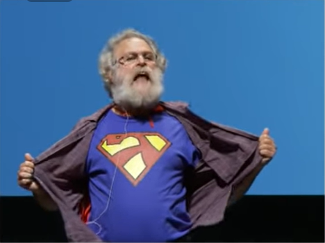

# (可能是写给数学人)函数式编程简介

以Haskell为代表的函数式编程语言(functional programming language, 简称FP)可能是人人都听说过的，但从数据上来看普及率还相对较低。函数式语言不仅是计算机辅助证明的基础，事实上在我看来这本来也是最适合有一定数学基础的人学习的程序语言。然而我其实没看到很concise引导文章，要不然过于详尽，要不然作者没有足够的数学基础。而FP方面的大佬往往更倾向于讨论更技术性的问题，所以入门级别的文章的确不多见。于是想写一篇作为[计算机辅助证明简介](https://zhuanlan.zhihu.com/p/181671237)的后续(或者前置)，一方面正好可以讲解一些在辅助证明中需要用到的概念和思想，另一方面也是对FP的安利吧。也可以也看作是学习笔记吧，有错误的地方也欢迎指正。

事实上我自己也算是FP入门新手，不可能讲太深刻的东西，不过正是这样我恰恰还能体会一些入门时的困难点。本文将不限于某种特定的语言，更关注FP背后的思想。我依旧把我介绍的内容归为数学，正如Haskell的创始人之一Philip Wadler在[一次演讲](https://www.youtube.com/watch?v=IOiZatlZtGU)的最后讲到的一样
>我认为**信息学**(informatics)是一个更好的词(来描述这些知识)，计算机科学(computer science)只有计算机和科学。因为这些知识并不是只与计算机有关，它是关于**信息的模式**(patterns of information)的。另外如果你是真正的科学的话，你不用把科学加到你的名字里。



## 为什么FP很重要

相信类似的说法大家已经看过很多了，其中最为经典的便是Haskell的另一创始人John Hughes(Haskell的创始人真的有点多)的同名[论文](https://www.cs.kent.ac.uk/people/staff/dat/miranda/whyfp90.pdf)和[演讲](https://www.bilibili.com/video/BV14W411b7cr)。

在没有介绍详细内容前，我能谈到的一些基于我个人经历的感受。

- 理解之后，上手很快
  - 我真正开始学习FP到现在也就大半年，我在2020年元旦开始学习elm，不到一个月后(中途还夹杂着期末考试)我就用它做了一个[黎曼面上游戏demo](https://github.com/iamcxds/Monodromy)(当然这也和elm本身易上手有关)。里面用到的很多方法都是命令式编程实现起来很麻烦的

- 轻松写出bug-free的代码
  - 我依旧记得用C#做游戏遇到莫名其妙的bug气得锤桌子。但是利用基于类型系统的静态类型检查，FP可以在代码还未编译前就发现错误，并且根据有类型信息的报错信息这些错误往往很容易改正。因为是没有副作用(side effect)的纯函数代码，除此之外的bug就很少了，elm甚至声称它不会有runtime错误。
  
- 基于类型的代码好写更好读
  - 类型系统除了能提供静态检查功能外，还能提供大量的信息(在计算机辅助证明中甚至能代表数学命题)。通过类型系统，我们可以构建更好的程序模型(如接下来会介绍的elm架构)，更有助于我们拆分模块化程序。而程序函数的类型同时也能起到指示函数的作用的功能，这也极大的帮助了我这样不习惯写注释的人看懂自己的代码。

## 年轻人的第一个FP程序
  
对于第一次学习FP的人，我一定会推荐[elm](https://elm-lang.org/)这个语言，不仅因为它简单(虽然功能有限)，而且是直接编译成网页的JavaScript脚本。这两点意味着它可以极快速地构建出可视的小玩意(而不只是命令行里的一句`Hello world`)，甚至不需要用户安装任何东西，直接在浏览器里捣鼓[在线编辑器](https://elm-lang.org/try)就可以了。
当然如果未来真的希望使用FP进行JS相关的开发，我还是更推荐功能更全面的[Purescript](https://www.purescript.org/)，不过Purescript不太适合初学者上手，所以也可以先学习elm作为跳板。

我们便使用elm作为我们目前例子的语言，因为各种FP里的语法结构大同小异，切换起来也很方便。

在开始正式介绍之前，我们先明确一下**函数**(function)和**类型**(type)的概念。函数最粗浅地理解是就是类型(集合)之间的映射，除此之外不做任何事情。数学上对函数的认识是考虑它具体**是什么**，并认为它是“瞬间”完成的，而不是考虑**一步一步**去达成目标。这也是FP和命令式编程在思想上的核心区别。
用$A \rightarrow B$记类型A到类型B的函数的类型。最简单的例子

```elm
plusOne : Int -> Int
plusOne n = n + 1 --用这种方式定义函数，把自变量直接写在函数后
```

而因为函数本身也构成类型，所以函数类型也可以作为定义域和值域(甚至有些情况下函数类型与非函数类型没有明确的界限)

```elm
five : (Int -> Int) -> Int --函数类型作为定义域
five f = f 5 --即 f(5)，而这种写法可以省去不少括号。
--以函数为自变量固定取其在5的值作为结果的函数。

plus : Int -> (Int -> Int)--函数类型作为值域，我们默认 ->是右结合的，所以这种时候的括号可以省略
plus x =
  let --使用let in可以定义一些局部使用的记号
    xPlus : Int -> Int --这里的类型声明可以省略
    xPlus y = x + y --根据x得到的加上x函数
  in
    xPlus --以xPlus为结果

--不过这样下去类型会写得越来越长，我们可以给类型命名
type alias IIi = Int -> Int -> Int
--另外你会嫌定义函数太麻烦，其实我们有更简便的写法
plus1 : IIi
plus1 x = \y -> x+y -- 用\符号可以定义一个匿名函数，\y表明自变量，箭头 -> 后写上函数的结果，后面我们可以看到这是一种λ表达式。

--当我们运行函数时
> (plus 3) 5 -- 先计算plus 3的结果，得到加3的函数，再对5应用
8
> plus1 5 3 --函数的应用默认是右结合的，所以可以不用加括号
8
```

我们很惊讶的发现，当我们用函数作为值域的时候似乎定义出了二元函数。事实上这并不奇怪，在集合范畴我们很容易得到同构$\rm{Hom}(A,\rm{Hom}(B,C))\cong\rm{Hom}(A\times B,C)$(Hom在这里就表示两个集合间的映射集合)。如果继续这种操作，我们甚至可以定义任意多元函数类型。这种将多元函数定义为值域为函数的函数的操作，被称为curry化。这样操作带来的好处是：从内核上来讲FP里面只有单元函数，各种系统和理论处理起来更容易(认识到这件事能对读懂报错信息很有帮助)；但是使用时可以没有通常区别得一样定义，使用任意多元函数。

```elm
plus2 : IIi
plus2 x y = x + y --可以直接像多元函数一样定义

plus3 : IIi
plus3 =\x y -> x + y --也可以直接用匿名表达式定义“多元”函数
```

### Elm架构(The Elm Architecture)

所有第一次听说FP的人都会有这样的疑问：如果真的是没有副作用的纯函数程序话，如何实现人机交互？不然除了能做计算程序还可以干什么？

专家也许马上会开始解释什么是monad，但是与其让初学者陷入这些概念的泥潭，我们不如先把这个东西当成黑盒(black box)，我们先来看看有了某个黑盒之后纯函数是怎么通过其实现交互程序的。

Elm架构就是一个很好的黑盒，事实上它本身也是诸如网页应用，游戏等交互程序很好的范式。虽然我总觉得这么好的东西可能不是elm原创的，这个架构也有一些FRP(functional reactive programming)的影子，不过似乎网上都这样叫我们就沿用吧。我们主要参考的是elm的[官方指导](https://guide.elm-lang.org/)，这个官方写得挺好挺concise，之后大家可以自行继续学习。

一个交互程序可以分解为三个部分：

- 模型(Model)——某个数据类型用于存储当前状态,另外我们还应该定义一个初始数据对应于程序刚开始的状态
- 显示(View)——将当前状态数据渲染成前端显示元素的函数，在这里是渲染成Html代码
- 更新(Update)——根据前端传来的消息(message，简写msg)对状态数据进行更新的函数

")

根据描述，我们大概可以想象这些部分所需要函数和类型。

```elm
--首先是模型部分
type alias Model = ... --定义状态数据类型
init : Model
init = ... --定义初始数据

--接下来是更新部分

type alias Msg = .. --定义消息类型

update : Msg -> Model -> Model --有两种角度来看待这个函数：当做是消息和当前状态的二元函数，以此决定下一个函数；当做是消息的一元函数，结果是对状态如何更新的函数
update msg model = ...

--最后是显示类型

view : Model -> Html Msg -- 这里类型写成这样的具体含义不用管，因为网页即是显示部件又是交互部件，这样的含义是把状态渲染成Html网页，而且网页可以回传Msg类型的消息
view model = ...
```

所以，对于一个最简单的例子，做一个可以加减数的按钮，代码就是[这样](https://elm-lang.org/examples/buttons),大家可以点击代开在线编辑器体验。

```elm
-- MAIN
main =
  Browser.sandbox { init = init, update = update, view = view }--Browser.sandbox就是黑盒的本体，只需要按规定定义好类型和函数，输入进去就可以实现想要的程序。另外由于FP不是逐条运行命令的，所以这些定义在前在后都不影响。
--sandbox另一个神奇的地方在于，不像我们之前定义的函数，自变量类型是固定的，而是满足一定相关条件的类型都可以接受。这实际上是一种多态(polymorphism),这种功能需要更复杂的类型系统才能实现，比如后文会提到的type class。
-- MODEL
type alias Model = Int
init : Model
init =
  0
-- UPDATE
type Msg  --Msg所对应的类型的含义我们将在后文讲解
  = Increment
  | Decrement
update : Msg -> Model -> Model
update msg model =
  case msg of  --这里使用了模式匹配(pattern matching),将在后文讲解
    Increment ->
      model + 1

    Decrement ->
      model - 1
-- VIEW
view : Model -> Html Msg
view model =
  div []
    [ button [ onClick Decrement ] [ text "-" ]
    , div [] [ text (String.fromInt model) ]
    , button [ onClick Increment ] [ text "+" ]
    ]-- elm 语言中以函数的写法写得html，注意到 onClick触发的是Msg类型的消息
```

我们可以设想一下如果我们要做一个todoList的应用还需要哪些功能和函数？

### 并类型(union type)与模式匹配(pattern matching)

- coproduct 的泛性质
- 递归函数 recursive

### 归纳类型(inductive type)与模式匹配(pattern matching)

- tree and the natural number

## 函子(functor)，单子(monad)与type class

- (list monad,IO monad,state monad 实现elm架构)
- type class 数学的抽象，冒泡排序

## lambda 演算(lambda calculus)

## 结语

- 一种理念上的编程，缺乏对效率的考虑
  